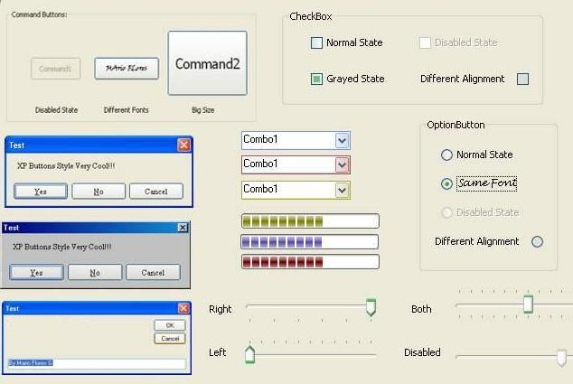



## WinXPC Engine \(Optimized drawing technique in buttons 16/02/04 \)

### Description

Give your Visual Basic Controls a Windows Xp Visual Style,WinXPC Engine is the largest collection of Subclass routines , uses only code (no Images)

No need to replace any control of your app,or add any other control to support VisualStyles, Controls that are supported:

ListView,Slider,ProgressBar,StatusBar,TabStrip,ComboBox,OptionButton,CheckBox,CommandButton,TextBox...and much more

even subclass MsgBoxes and InputBoxes without adding any extra lines to your code.

Some of the controls support System Color Theme,some XP Colors may vary but they look close Enough.

Im Working on adding support for external classes so you can subclass other pre-made ocx automatically..but right

now you must do this manually, C++ or Windows Classes are easy to get,but i recommend using Spy ++

if you don't know the name of the class.

Mainly the Logical Structure of the code is a Visual C++ one, because of the use of so many messages and APIS ,but its no big deal actually..

If you follow the code carefully you will find this as easy as 1,2,3.

The Engine supports Win 98,Me,2000,XP, but i haven't tested fully on all OS version ..almost every test was made on XP Pro

Remember This is Full Source code and Free (Not Fully Completed)..so mainly one of my objectives is that coders see & test the

code so they can give me they point of view and Suggestions...then finish the ocx with a better code.! ...

Full code included no external dependencies. Enjoy and leave your votes!
 
### More Info
 

             |
---                |---
**Submitted On**   |2004-02-16 22:23:32
**By**             |[MArio Flores G](https://github.com/Planet-Source-Code/PSCIndex/blob/master/ByAuthor/mario-flores-g.md)
**Level**          |Advanced
**User Rating**    |4.9 (678 globes from 137 users)
**Compatibility**  |VB 6\.0
**Category**       |[Custom Controls/ Forms/  Menus](https://github.com/Planet-Source-Code/PSCIndex/blob/master/ByCategory/custom-controls-forms-menus__1-4.md)
**World**          |[Visual Basic](https://github.com/Planet-Source-Code/PSCIndex/blob/master/ByWorld/visual-basic.md)
**Archive File**   |[WinXPC\_Eng1709822172004\.zip](https://github.com/Planet-Source-Code/mario-flores-g-winxpc-engine-optimized-drawing-technique-in-buttons-16-02-04__1-51400/archive/master.zip)

### API Declarations

A lot ;)

